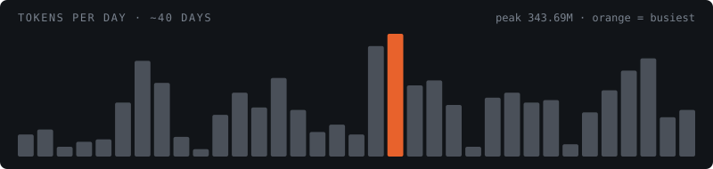

# Hi, I'm Anshik 👋

**Full Stack Engineer | Gen AI & Agentic AI** — I build AI products end to end: React/Next.js frontends, Node and FastAPI backends, and agentic systems with Langgraph, Langchain and MCPs.

🌐 [Portfolio](https://me-gilt-two.vercel.app/) · 💼 [LinkedIn](https://www.linkedin.com/in/anshik-gupta-5a99ab192/) · ✍️ [Hashnode](https://hashnode.com/@UserWithNoName) · 📧 guptaanshik1@gmail.com

## What I'm working on

- **Reclosed** — AI SMS/WhatsApp outreach platform: an AI agent runs multi-turn campaign conversations over Twilio. Built the Next.js app, Express API and send/webhook worker, a RAG knowledge base, an MCP server with OAuth-scoped tools, and migrated auth from Clerk to Supabase with MFA.
- **Sourcefuse** — Full stack work on Shop Reservation System and Assesslens (React, Loopback4, PostgreSQL, Turborepo microservices).

## AI-driven engineering

- A test-writing skill that uses multiple MCPs and takes pull request scores above 9.
- A QA agent that pulls requirements from Atlassian, checks git changes and verifies them locally.
- Spec-driven development (SDD) with Agent OS to ship big features faster.

### My Claude Code usage

Real numbers from my own tooling over ~40 days — evidence of how much production work runs through an agentic loop.

| Total tokens | API calls | Prompts | Peak / day |
|:---:|:---:|:---:|:---:|
| **4.83B** | **14,842** | **1,738** | **343M** |
| across every project | 15,019 tool calls | ≈8.5 calls each | avg 134M |

## Projects

- [**WellSync**](https://well-sync-six.vercel.app/) — AI wellness platform: profile-based insights, habit analysis and personalized plans. *FastAPI, Langchain, Langgraph, Supabase, MCPs*
- [**time-operations**](https://www.npmjs.com/package/time-operations) — Published npm package of JavaScript utilities for time-based operations.
- [**Schedule Reminder**](https://github.com/guptaanshik1/scheduleReminder) — MERN app that emails reminders before an activity starts or ends.

## Open source

- [Milan #657](https://github.com/tamalCodes/Milan/pull/657) — fixed a scrolling issue when navigating between tabs.
- [React Play #1114](https://github.com/reactplay/react-play/pull/1114) — added a game with API video search and hover previews.

## Stack

`React` `Next.js` `TypeScript` `Node.js` `Express` `FastAPI` `Langchain` `Langgraph` `MCP` `PostgreSQL` `Supabase` `TailwindCSS` `Zustand` `Claude Code` `Copilot`
